# Shader Pack Integration Guide <Badge type="warning" text="0.9.0-alpha.1 ~ latest" /> <Badge type="tip" text="v3" />

**Schema Version: 3**

## Introduction

This guide explains how to integrate these super resolution algorithms into your shader pack for a performance boost.

### What Is Super Resolution?

Super resolution is a technique that reconstructs a high resolution image from a low resolution image. It delivers a performance gain by upscaling a low resolution image to a higher resolution one, though it may cost some image quality.

### What Does the SR Mod Do?

The SR (Super Resolution) mod brings super resolution algorithms commonly used in modern games — such as NVIDIA DLSS, Intel XeSS, and AMD FSR — into Minecraft, and provides an interface for shader packs to use them.

### How Does Super Resolution Work?

The SR mod requires your shader pack to scale the viewport itself and compute motion vectors, and to tell SR which color buffer holds this data and in which region of that buffer. SR then invokes the actual super resolution algorithm for your shader pack (for example DLSS; this mainly depends on the user's choice). Once upscaling is complete, SR writes the result into the region you specified of the color buffer you specified.

---


Before reading this guide, we recommend that you first read the following parts of the AMD FSR2 documentation:

* [Input resources of super resolution algorithms](https://github.com/GPUOpen-Effects/FidelityFX-FSR2#input-resources) — in SR we only need Color (scaled size: the scene color rendered at low resolution), Depth (scaled size: the scene depth buffer rendered at low resolution), Motion vectors (also called Velocity; scaled size: scene object motion rendered at low resolution), and Exposure (1x1, exposure).
* [Motion vector input format required by super resolution algorithms](https://github.com/GPUOpen-Effects/FidelityFX-FSR2#providing-motion-vectors) — in Minecraft, the limitations of Iris make entity motion hard to obtain, so here we can provide SR with motion vectors that contain only camera motion.
* [Exposure input required by super resolution algorithms](https://github.com/GPUOpen-Effects/FidelityFX-FSR2#exposure)
* [Super resolution algorithms and TAA](https://github.com/GPUOpen-Effects/FidelityFX-FSR2#temporal-antialiasing) — in your shader pack, TAA should not run alongside super resolution; super resolution should replace TAA outright.
* [Camera jitter](https://github.com/GPUOpen-Effects/FidelityFX-FSR2#camera-jitter)
* [Mipmap bias](https://github.com/GPUOpen-Effects/FidelityFX-FSR2#mipmap-biasing)

## Integration

The whole integration process is roughly divided into the following steps:

1. Create a `superresolution.json` file next to `shaders.properties` and write in the basic information.
2. Modify your shader pack so that it can render at the render precision (render scale) SR specifies. _(This is usually the most troublesome step.)_
3. Modify your shader pack so that it applies the Camera Jitter provided by SR when rendering, rather than its own Camera Jitter. _(But we provide a way to let SR work under the Camera Jitter provided by your shader pack; see below for details.)_
4. Update `superresolution.json` so that SR knows which color buffer to read the inputs from and which color buffer to write the result to.
5. Test and adjust until the final image has no ghosting or blurring.
6. Final optimization: adjust where SR is executed, apply mipmap bias, and so on.

### Step 0

In the root directory of your shader pack (next to `shaders.properties`), create a file named `superresolution.v3.json`.

::: tip
The mod tries `superresolution.v3.json`, `superresolution.v2.json`, and `superresolution.v1.json` in descending schema version order and finally falls back to `superresolution.json`, using the first file it finds.
Using an explicitly versioned file name is recommended, so that configurations of different schema versions can coexist during migration.
:::

Template:

```json
{
  "schema_version": 3,
  "profiles": {
    "*": {
      "jitter": {
        "enabled": true
      },
      "upscale": {
        "enabled": true,
        "internal_format": "rgba16f",
        "auto_exposure": true,
        "hdr": true,
        "motion_jittered": false,
        "pre_exposure": {
          "source": "const",
          "type": "float",
          "value": 1.0
        },
        "trigger": {
          "type": "BEFORE",
          "pass": "composite1"
        },
        "inputs": {
          "color": {
            "enabled": true,
            "src": "colortex0",
            "region": [
              0,
              0,
              -1,
              -1
            ]
          },
          "depth": {
            "enabled": true,
            "src": "depthtex",
            "region": [
              0,
              0,
              -1,
              -1
            ]
          },
          "motion_vectors": {
            "enabled": true,
            "src": "colortex16",
            "region": [
              0,
              0,
              -1,
              -1
            ]
          }
        },
        "outputs": {
          "upscaled_color": {
            "enabled": true,
            "target": [
              "colortex0"
            ],
            "region": [
              0,
              0,
              -2,
              -2
            ]
          }
        }
      }
    }
  }
}
```

Reload your shader pack now, and SR will inject the additional macros and uniforms (see the [Appendix](#macros-and-uniforms)) into your shaders. You can now use these macros and uniforms in your shaders to adjust rendering behavior.

---

### Step 1

In this step, you should enable your shader pack to:

* Render according to the render scale provided by SR
* Compute motion vectors

---

#### Our Recommended Approach

<br>

##### Render Scaling

* Adjust the size of the buffers used to store the scene color and related data:
  - Use `size.buffer.colortex<N> = <WIDTH_SCALE> <HEIGHT_SCALE>`
* Scale vertices during the gbuffer stage:
  ```glsl
  ////////////////Helper////////////////
  // jitter = vec2(
  //               SRJitterOffset.x * 2.0 / (viewportSize.x * SR_RENDER_SCALE_FACTOR),
  //               SRJitterOffset.y * 2.0 / (viewportSize.y * SR_RENDER_SCALE_FACTOR)
  //          )
  // Note: SRJitterOffset is a uniform SR injects into your shaders; we recommend computing jitter on the CPU with the custom uniform feature.
  void transformVertexPosition(out vec4 vertPos, vec3 viewPos, vec2 jitter) {
      vertPos = project(gl_ProjectionMatrix, viewPos);
      // SR_RENDER_SCALE_FACTOR is a macro SR injects into your shaders.
      vertPos.xy = vertPos.xy * SR_RENDER_SCALE_FACTOR + (SR_RENDER_SCALE_FACTOR - 1.0) * vertPos.w;
      vertPos.xy += jitter * vertPos.w;
  }
  ////////////////Your Vertex shader////////////////
  void main(){
      //////////////.........//////////////
      vec3 viewPos = (gl_ModelViewMatrix * gl_Vertex).xyz;
      transformVertexPosition(gl_Position,viewPos,jitter);
      //////////////.........//////////////
  }
  ```

::: tip
In Iris the depth buffer is always at native resolution, so you should apply the render scale everywhere you need to sample `depthtex<N>`.
:::

##### Computing Motion Vectors

In general, providing SR with motion vectors that contain only camera motion already gives good quality, so you can compute motion vectors with the following code:

```glsl
// Helper
vec3 ReprojectScreenPos(vec3 screenPos) {
    vec3 ndcPos = screenPos * 2.0 - 1.0;

    vec4 viewPos4 = gbufferProjectionInverse * vec4(ndcPos, 1.0);
    vec3 viewPos = viewPos4.xyz / viewPos4.w;

    vec4 worldPos4 = gbufferModelViewInverse * vec4(viewPos, 1.0);
    vec3 worldPos = worldPos4.xyz / worldPos4.w;

    worldPos += (cameraPosition - previousCameraPosition) * step(0.56, screenPos.z);

    vec4 prevView4 = gbufferPreviousModelView * vec4(worldPos, 1.0);
    vec3 prevView = prevView4.xyz / prevView4.w;

    vec4 prevClip = gbufferPreviousProjection * vec4(prevView, 1.0);
    vec3 prevNDC = prevClip.xyz / prevClip.w;

    // NDC (-1..1) -> screen (0..1)
    return prevNDC * 0.5 + 0.5;
}

vec2 ComputeCameraMotionVectors(vec2 screenCoord){
    // Please implement LOAD_DEPTH yourself
    float depth = LOAD_DEPTH(screenCoord * SR_RENDER_SCALE_FACTOR).x;
    vec2 motionVector = ReprojectScreenPos(vec3(screenCoord, depth)).xy - screenCoord;
    return motionVector;
}
```

::: tip
You can also use the `at_velocity` extension provided by SR to compute entity motion vectors; see the [Appendix](#at-velocity) for details.
:::

Finally, your shader pack should respond correctly to the render scale setting from SR.

### Step 2

Find a place in your pipeline to run SR (usually it should be the same place as the TAA pass).

In general, super resolution sits roughly at the following position in the shader pipeline:

```mermaid
graph LR
    classDef renderRes fill: #b0b0b0, stroke: #333, stroke-width: 2px
    classDef displayRes fill: #c2dfb0, stroke: #333, stroke-width: 2px
    classDef startEnd fill: #466cb1, stroke: #333, stroke-width: 2px, color: #fff
    classDef srNode fill: #70ad47, stroke: #333, stroke-width: 2px, color: #fff
    classDef processNode fill: #466cb1, stroke: #333, stroke-width: 2px, color: #fff
    Start([Shadowmap]):::startEnd
    RenderRaster[Gbuffers]:::processNode
    StartPost["Deferred Passes & Some Composite Passes"]:::processNode
    SR{{Upscaling/Super Resolution}}:::srNode
    PostEffects[Post Effects]:::processNode
    Tonemap[Tonemap]:::processNode
    FinalOut([Final Out]):::startEnd

    subgraph Render_Resolution [Render Resolution]
        direction LR
        RenderRaster --> StartPost
    end

    subgraph Display_Resolution [Display Resolution]
        direction LR
        PostEffects --> Tonemap
    end

    Start --> RenderRaster
    StartPost --> SR
    SR --> PostEffects
    Tonemap --> FinalOut
    style Render_Resolution fill: #b0b0b0, stroke: #333, stroke-width: 2px
    style Display_Resolution fill: #c2dfb0, stroke: #333, stroke-width: 2px
```



Finally, your shader pack should produce an image without obvious aliasing or ghosting.

### Step 3

Do some optimization work, such as applying mipmap bias (you can refer to section `3.5` of the NVIDIA DLSS [documentation](https://github.com/NVIDIA/DLSS/blob/main/doc/DLSS_Programming_Guide_Release.pdf)).

## Interface Configuration File Specification

### Profiles

You can configure different SR parameters for different dimensions. Each key in `"profiles"` corresponds to a dimension.

When a dimension loads, SR looks up the configuration in the following order:

1. First, it looks for a matching key (e.g., `"0"` for the Overworld).
2. If none is found, it uses `"*"` as the default configuration.
3. If neither exists, super resolution is disabled for that dimension.

| Key    | Dimension        |
|--------|------------------|
| `"0"`  | Overworld        |
| `"-1"` | Nether           |
| `"1"`  | End              |
| `"*"`  | Default fallback |

> Dimension keys are determined by the dimension mapping of the shader pack itself (the same mapping the `dimension.properties` configuration in Iris uses).

### Trigger

```json
"trigger": {
    "type": "AFTER",
    "pass": "composite1"
}
```

- `"type"` — `"BEFORE"` or `"AFTER"`. Determines whether SR runs **before** or **after** the specified pass.
- `"pass"` — The name of a composite pass (e.g., `"composite"`, `"composite1"`, `"composite2"`, ...).

<a id="after-trigger-autotex-warning"></a>
::: warning **When you use the `AFTER` trigger type together with `autotex<N>`, SR reads from and writes to the buffer that is equivalent to using the `BEFORE` trigger type.**
:::

::: warning **Only composite passes are supported.**
:::

### Inputs

All temporal upscaling algorithms require the three core inputs `color`, `depth`, and `motion_vectors`, and you must provide them.

```json
"inputs": {
    "color": {
        "enabled": true,
        "src": "colortex0",
        "region": [
            0,
            0,
            -1,
            -1
        ]
    },
    "depth": {
        "enabled": true,
        "src": "depthtex",
        "region": [
            0,
            0,
            -1,
            -1
        ]
    },
    "motion_vectors": {
        "enabled": true,
        "src": "colortex16",
        "region": [
            0,
            0,
            -1,
            -1
        ]
    }
}
```

#### Input Resource Types

| Input | Applies to | Description |
| --- | --- | --- |
| `color` | Required | Scene color rendered at the scaled resolution. |
| `depth` | Required | The depth buffer. |
| `motion_vectors` | Required | Per-pixel motion vectors in UV space (RG channels). |
| `exposure` | Optional | Exposure value, a 1x1 texture. |
| `diffuse_albedo` | DLSS-RR required | Linear diffuse albedo. |
| `specular_albedo` | DLSS-RR required | Linear specular albedo. |
| `normal_roughness` | DLSS-RR, one of two | RGB normals with linear roughness in the alpha channel. Takes precedence over the separate normal/roughness inputs when present. |
| `normals` | DLSS-RR, one of two | Normalized shading normal, paired with `roughness`. |
| `roughness` | DLSS-RR, one of two | Linear roughness, paired with `normals`. |
| `specular_motion_vectors` | DLSS-RR optional | Dense motion vectors of reflected geometry. |
| `specular_hit_distance` | DLSS-RR optional | World-space distance from the primary surface to the hit point of a specular ray. |
| `transparency_layer` | DLSS-RR optional | The transparent color layer separated from the noisy color. |
| `transparency_layer_opacity` | DLSS-RR optional | Opacity paired with the transparent color layer. |
| `color_before_transparency` | DLSS-RR optional | The noisy color before transparent content is composited. |
| `screen_space_subsurface_scattering_guide` | DLSS-RR optional | Single-channel screen-space subsurface scattering guide. |
| `depth_of_field_guide` | DLSS-RR optional | Single-channel depth-of-field guide. |

::: info DLSS-RR stands for NVIDIA DLSS Ray Reconstruction. We will not go into what it does here; you can read its documentation [here](https://github.com/NVIDIA-RTX/Streamline/blob/main/docs/ProgrammingGuideDLSS_RR.md) and [here](https://github.com/NVIDIA/DLSS/blob/main/doc/DLSS-RR%20Integration%20Guide.pdf).
:::

<a id="resource-sources"></a>

#### Input Resource Sources ("src")

**`src`** can be any of the following texture names:

| Name | Description |
| --- | --- |
| `colortex0` – `colortex31` | Color textures |
| `alttex0` – `alttex31` | Variants of color textures; they point to alt textures instead of main textures |
| `autotex0` – `autotex31` | Variants of color textures that automatically handle whether the texture is read from or written to alt or main (it has some [flaws](#after-trigger-autotex-warning)) |
| `depthtex` | Main depth texture, corresponding to `depthtex0` |
| `noHandDepthtex` | Depth texture without the hand, corresponding to `depthtex1` |
| `noTranslucentDepthtex` | Depth texture without translucent objects, corresponding to `depthtex2` |

#### Region ("region")

The `"region"` field specifies which region of the texture to read from or write to:

```text
"region": [X, Y, W, H]
```

| Value | Meaning |
|-------|---------|
| `≥ 0` | Explicit pixel coordinate / size |
| `-1`  | The full **render resolution** (the scaled resolution the shader pack uses) |
| `-2`  | The full **screen resolution** (the actual display resolution) |

- `X` and `Y` must be ≥ 0. Negative values are not allowed for the position.
- `W` and `H` can be positive, `-1`, or `-2`.

::: tip
In [Frame Generation Only mode](#frame-generation-only), the render resolution equals the screen resolution, so `-1` and `-2` resolve to the same result.
:::

### Output

`"outputs"` must contain exactly one key: `"upscaled_color"`.

```json
"outputs": {
    "upscaled_color": {
        "enabled": true,
        "target": [
            "colortex0"
        ],
        "region": [
            0,
            0,
            -2,
            -2
        ]
    }
}
```

- `"target"` — The name of the buffer to write the upscaled result to (see the [list above](#resource-sources)). If multiple targets are specified, the result is written to each of them in order. All targets must have the same dimensions.
- The output is at screen resolution (the unscaled resolution).

::: warning
In [Frame Generation Only mode](#frame-generation-only), SR does not perform upscaling and does not write `upscaled_color`.
:::

### Internal Format

```json
"internal_format": "r11g11b10f"
```

Specifies the texture format SR uses internally for processing.

Supported values:

| Value | Format |
|-------|--------|
| `r11g11b10f` | R11G11B10F |
| `rgba8` | RGBA8 |
| `rgba16f` | RGBA16F |

If omitted or unrecognized, it defaults to `RGBA16F`, but specifying it is strongly recommended, because the default format may differ between SR versions. Also, SR allows the user to manually override this setting (even when the shader pack specifies it explicitly).

### Pre-exposure

```json
"pre_exposure": {
    "source": "const",
    "type": "float",
    "value": 1.0
}
```

- **Optional field**.
- **Only accepts scalar types**: `float`, `int`, `uint`.
- **Default value**: `1.0`.
- `source` should be `"const"`, `"variable"`, or `"uniform"`.
- When `source == "const"`, `value` must be a number;
- When `source == "variable"` or `source == "uniform"`, `value` must be a non-empty string (the variable/uniform name).

### HDR Input/Output

```json
"hdr": true
```

- **Type**: `boolean`
- **Default**: `false`

### Auto Exposure

```json
"auto_exposure": true
```

- **Type**: `boolean`
- **Default**: `false`
- Enables automatic exposure computation.
- **Note**: If the `exposure` texture input in `inputs` is also enabled, SR prefers the `exposure` texture.

### Motion Vector Jittered

```json
"motion_jittered": false
```

- **Type**: `boolean`
- **Default**: `false`
- Indicates whether the motion vectors already include jitter.
- When set to `true`, it means the motion vectors already account for the subpixel jitter offset, and SR will not apply additional jitter-related motion vector correction.
- When set to `false` (default), SR assumes the motion vectors correspond to un-jittered sample positions.

### Frame Generation Only {#frame-generation-only}

```json
"supports_frame_generation_only": true
```

- **Type**: `boolean`
- **Default**: `false`
- Declares that your shader pack is compatible with **Frame Generation Only mode**.

Frame Generation Only mode is a working mode introduced in 0.9.0: it does not perform super resolution and only provides SR with the input data needed for frame generation (color, depth, motion vectors, exposure), leaving SR to perform frame generation.

**Behavior:**

- The render scale is forced to `1.0`, and your shader pack should render the scene at **native (screen) resolution**; `-1` (render resolution) in `region` then equals `-2` (screen resolution).
- SR still reads the `color`, `depth`, `motion_vectors`, and `exposure` inputs you provide at the trigger point (they are used for frame generation), so these inputs must still be provided as usual.
- SR does **not** perform super resolution and does **not** write the `upscaled_color` output.

**Macro values in this mode:**

| Macro | Value |
|-------|-------|
| `SR_ENABLE` | `1` |
| `SR_USING_ALGO` | `SR_ALGO_NONE` |
| `SR_SHOULD_APPLY_SCALE` | `0` |
| `SR_SHOULD_APPLY_JITTER` | `0` |
| `SR_ALGO_SUPPORTS_JITTER` | `0` |
| `SR_RENDER_SCALE_FACTOR` | `1.0` |
| `SR_UPSCALE_RATIO` | `1.0` |
| `SR_SCALED_WIDTH` / `HEIGHT` | Equal to the screen resolution |
| `SR_JITTER_SEQUENCE_LENGTH` | `0` |

Your shader pack should detect this mode through `SR_USING_ALGO == SR_ALGO_NONE`, render at native resolution, and skip jitter application.

### Disabled Algorithms

```json
"disabled_algorithms": [
    "fsr1",
    "anime4k"
]
```

- **Type**: array of strings
- **Default**: `[]` (nothing disabled)
- Declares the list of algorithms your shader pack is **incompatible** with.

Available algorithm IDs:

| ID | Algorithm |
|----|-----------|
| `none` | None (no upscaling; see Frame Generation Only mode) |
| `fsr1` | AMD FSR 1 |
| `fsr2` | AMD FSR 2 |
| `fsr` | AMD FSR (FSR 2/3) |
| `xess` | Intel XeSS |
| `dlss` | NVIDIA DLSS |
| `dlssrr` | NVIDIA DLSS Ray Reconstruction |
| `sgsr1` | Snapdragon SGSR 1 |
| `sgsr2` | Snapdragon SGSR 2 |
| `nss` | ARM Neural Super Sampling (WIP) |
| `anime4k` | Anime4K |

::: tip

We recommend disabling:

* `fsr1`
* `fsr2`
* `sgsr1`
* `sgsr2`
* `anime4k`
* `dlssrr`
  :::

### Jitter

When enabled, SR generates a subpixel jitter offset each frame. Your shader pack can read the jitter value through the provided uniform (see below) and apply it to the projection matrix.

_(SR may not work correctly when you declare jitter disabled)_

```json
"jitter": {
    "enabled": true,
    "source": "mod",
    "source_config": {
        "jitter_offset": {
            "source": "uniform",
            "type": "vector2f",
            "value": "taa_jitter_offset"
        },
        "jitter_sequence_length": {
            "source": "const",
            "type": "int",
            "value": 8
        }
    }
}
```

The corresponding `shaders.properties` configuration:

```properties
# You can use SR-provided uniforms such as SRJitterOffset directly in expressions
variable.vec2.taa_jitter_offset=vec2(SRJitterOffset.x,SRJitterOffset.y)
# uniform.vec2.taa_jitter_offset=vec2(SRJitterOffset.x,SRJitterOffset.y)
```

The table below explains the fields in the JSON example above:

| Field | Type / Example | Description |
| --- | --- | --- |
| `source` | `"mod"` / `"shaderpack"` | Optional, default `"mod"` (SR generates jitter). If `"shaderpack"`, the shaderpack provides jitter; only in this mode does `source_config` take effect. This mode is experimental. |
| `source_config.jitter_offset.source` | `const` / `variable` / `uniform` | Specifies the source type of `jitter_offset`. |
| `source_config.jitter_offset.type` | `vector2f` | Must be `vector2f`, representing the X and Y components of the jitter value. |
| `source_config.jitter_offset.value` | e.g. `taa_jitter_offset` or `[0.0, 0.0]` | If `source` is `uniform`/`variable`, this is the uniform/variable name; for `const`, it is a constant array; for `variable`, it is a variable name in the shaderpack (the shaderpack is responsible for updating it). |
| `source_config.jitter_sequence_length.source` | `const` / `variable` / `uniform` | Specifies the source type of the sequence length. |
| `source_config.jitter_sequence_length.type` | `int` | Must be `int`, representing the jitter sequence length. |
| `source_config.jitter_sequence_length.value` | e.g. `8` | If `source` is `const`, this is an integer; if `uniform`/`variable`, this is a name. |

* Jitter value X, Y ∈ [-0.5, 0.5]
* If the currently active upscaling algorithm does not support jitter, both the X and Y components of the jitter are `0`.
* Jitter is not applied in Frame Generation Only mode (`SR_SHOULD_APPLY_JITTER` is `0`).

### Customs

The `customs` field sits under `upscale` and is a general-purpose extension field for providing algorithm-related custom configuration.

```json
"customs": {
    "motion_vector_preprocessing_function": "<GLSL function code>"
}
```

#### motion_vector_preprocessing_function

Allows custom GLSL preprocessing of motion vectors before they are fed into the upscaling algorithm.

**Requirements:**

- Must contain a function with the signature `vec2 motionVectorPreprocessing(vec2)`
- The `vec2` parameter is the motion vector, and the return value is the preprocessed motion vector

**Behavioral differences:**

- **FSR / DLSS / DLSS-RR / XeSS**: The motion vector passed to the function has already had its Y axis flipped (equivalent to `mv * vec2(1.0, -1.0)`). The function code is injected into `process_input_textures.comp` and called in the motion vector processing logic:

  ```glsl
  #ifdef HAS_MOTION_VECTOR
  layout(binding = 4) uniform sampler2D inputMotionVectors;
  layout(binding = 5, rg16f) uniform writeonly image2D outputMotionVectors;
  #endif

  // ...

  void main() {
      // ...
      #ifdef HAS_MOTION_VECTOR
      vec2 mv = texelFetch(inputMotionVectors, ivec2(texelCoord.x, flippedY), 0).rg;
      mv.y = -mv.y;
      #ifdef MOTION_VECTOR_PREPROCESSING_FUNCTION_INJECTED
      mv = motionVectorPreprocessing(mv);
      #endif
      imageStore(outputMotionVectors, texelCoord, vec4(mv, 0.0, 0.0));
      #endif
      // ...
  }
  ```

- **Other algorithms**: The motion vector passed to the function is the raw data (without any transformation). The function runs in a standalone pass:

  ```glsl
  #version 430 core

  layout(local_size_x = 16, local_size_y = 16, local_size_z = 1) in;

  layout(binding = 0) uniform sampler2D inputMotionVectors;
  layout(binding = 1, rg16f) uniform writeonly image2D outputMotionVectors;

  // MOTION_VECTOR_PREPROCESSING_FUNCTION_PLACEHOLDER

  void main() {
      ivec2 texelCoord = ivec2(gl_GlobalInvocationID.xy);
      ivec2 texSize = imageSize(outputMotionVectors);
      if (texelCoord.x < texSize.x && texelCoord.y < texSize.y) {
          vec2 mv = texelFetch(inputMotionVectors, texelCoord, 0).rg;
          #ifdef MOTION_VECTOR_PREPROCESSING_FUNCTION_INJECTED
          mv = motionVectorPreprocessing(mv);
          #endif
          imageStore(outputMotionVectors, texelCoord, vec4(mv, 0.0, 0.0));
      }
  }
  ```

**Usage example:**

```json
{
    "schema_version": 3,
    "profiles": {
        "*": {
            "upscale": {
                "customs": {
                    "motion_vector_preprocessing_function": "vec2 motionVectorPreprocessing(vec2 motionVector) { return vec2(0.0); }"
                }
            }
        }
    }
}
```

### Macros in Configuration

Starting from schema version 2, you can use macros in the configuration file. The supported macros are equivalent to those defined in `shaders.properties` (excluding macros newly defined in `shaders.properties`).

::: warning
In fact, the mod performs macro preprocessing on configuration files of any schema version, but for compatibility, do not use macros in versions below v2.
:::

### Motion Vector Input Format

Requirements for motion vectors:

- Stored in the **RG channels** of the source texture: R -> X, G -> Y.
- In **UV space** (normalized -1–1 coordinates).
- Computed as:

```text
motion_vector = previous_uv - current_uv
// motion_vector.x, motion_vector.y ∈ [-1.0, 1.0]
```

## Appendix

<a id="macros-and-uniforms"></a>

### SR-Provided Macros and Uniforms

When SR is installed and the shader pack contains a valid configuration file, SR injects the following macros and uniforms into your shaders. You can use them to adjust rendering behavior while SR is active.

#### Macros

| Macro | Description |
|-------|-------------|
| `SR_INSTALLED` | Always `1` when SR is installed. |
| `SR_CONFIG_SCHEMA_VERSION` | The schema version of the active interface configuration file — `3` when a V3 config is in use. |
| `SR_UPSCALE_RATIO_HALF` | Equal to 0.5 of the upscale ratio. `0.5` in Frame Generation Only mode. |
| `SR_RENDER_SCALE_FACTOR_HALF` | Equal to 0.5 of the render scale factor. `0.5` in Frame Generation Only mode. |
| `SR_ENABLE` | `1` when upscaling is enabled, `0` otherwise. Still `1` in Frame Generation Only mode. |
| `SR_DISABLE` | The inverse of `SR_ENABLE`. |
| `SR_USING_ALGO` | Integer ID of the currently active algorithm. `0` when upscaling is disabled. `SR_ALGO_NONE` in Frame Generation Only mode. |
| `SR_ALGO_<NAME>` | Integer ID of each registered algorithm (e.g., `SR_ALGO_FSR2`, `SR_ALGO_NONE`). Can be compared against `SR_USING_ALGO`. |
| `SR_ALGO_SUPPORTS_JITTER` | `1` when the active algorithm supports jitter, `0` otherwise. `0` in Frame Generation Only mode. |
| `SR_SHOULD_APPLY_SCALE` | `1` when upscaling is enabled and not in Frame Generation Only mode, `0` otherwise. |
| `SR_SHOULD_APPLY_JITTER` | `1` when upscaling is enabled and not in Frame Generation Only mode, `0` otherwise. |
| `SR_SCALED_WIDTH` | Render width (scaled resolution width). Equals the screen width when upscaling is disabled or in Frame Generation Only mode. |
| `SR_SCALED_HEIGHT` | Render height (scaled resolution height). Equals the screen height when upscaling is disabled or in Frame Generation Only mode. |
| `SR_SCREEN_WIDTH` | Screen width (display resolution width). |
| `SR_SCREEN_HEIGHT` | Screen height (display resolution height). |
| `SR_JITTER_SEQUENCE_LENGTH` | The length of the current jitter sequence (if jitter is enabled). `0` when jitter is unsupported, not enabled, or in Frame Generation Only mode. |
| `SR_RENDER_SCALE_FACTOR` | The current render scale factor (e.g., `0.5` at 50% scale). `1.0` when upscaling is disabled or in Frame Generation Only mode. |
| `SR_UPSCALE_RATIO` | The current upscale ratio (screen / render). `1.0` when upscaling is disabled or in Frame Generation Only mode. |
| `SR_ALGO_DLSS_RENDERPRESET` | Integer ID of the current DLSS render preset (e.g., `SR_ALGO_DLSS_RENDERPRESET_J`). `0` if the active algorithm is not DLSS or upscaling is not enabled. |
| `SR_ALGO_DLSS_RENDERPRESET_<PRESET>` | Integer ID of each registered DLSS render preset (e.g., `SR_ALGO_DLSS_RENDERPRESET_F`). Can be compared against `SR_ALGO_DLSS_RENDERPRESET`. There are currently `K`, `J`, `F`, `L`, and `M`. |

#### Uniforms

| Uniform | Type | Description |
|---------|------|-------------|
| `SRRenderScale` | `float` | The render scale factor (e.g., `0.5` at 50% scale). `1.0` when upscaling is disabled. |
| `SRRatio` | `float` | The upscale ratio (screen / render). `1.0` when upscaling is disabled. |
| `SRRenderScaleLog2` | `float` | `log2(render width / screen width)`. `0.0` when upscaling is disabled; usually used as the mipmap bias of certain textures. |
| `SRScaledViewportSize` | `vec2` | The render resolution, `vec2(width, height)`. |
| `SROriginalViewportSize` | `vec2` | The screen resolution, `vec2(width, height)`. |
| `SRScaledViewportSizeI` | `ivec2` | The render resolution, `ivec2(width, height)`. |
| `SROriginalViewportSizeI` | `ivec2` | The screen resolution, `ivec2(width, height)`. |
| `SRJitterOffset` | `vec2` | The jitter offset of the current frame (in pixel space). `vec2(0)` when jitter is unsupported, not enabled, or the shader pack specifies that it does not get jitter from SR. |
| `SRPreviousJitterOffset` | `vec2` | The jitter offset of the previous frame (in pixel space). `vec2(0)` when jitter is unsupported, not enabled, or the shader pack specifies that it does not get jitter from SR. |
| `SRFrameCount` | `int` | The current frame count. |

::: warning

Avoid using the `SR_SCALED_WIDTH`, `SR_SCALED_HEIGHT`, `SR_SCREEN_WIDTH`, and `SR_SCREEN_HEIGHT` macros in `shaders.properties`, as they do not update when the game window is resized. You should use `SR_UPSCALE_RATIO` or `SR_RENDER_SCALE_FACTOR` instead — they reload the shader pack when changed.

:::

When super resolution is disabled:

- Scale values are `1.0`.
- Jitter offsets are `vec2(0)`.
- `SR_USING_ALGO` is `0`.
- `SR_SCALED_WIDTH` / `SR_SCALED_HEIGHT` equal the screen dimensions.

In Frame Generation Only mode:

- `SR_SHOULD_APPLY_SCALE` / `SR_SHOULD_APPLY_JITTER` are `0`.
- `SR_USING_ALGO` is `SR_ALGO_NONE`.
- Scale-related macros are `1.0`, and `SR_SCALED_WIDTH` / `SR_SCALED_HEIGHT` equal the screen dimensions.

### Extension Features

#### Extended colortex Count

SR extends the number of colortex buffers to 32, which means you can use `colortex0` through `colortex31`.

#### OptiFine's `at_velocity` {#at-velocity}

::: tip
This feature was added in 0.9.2-alpha.1.
:::

Iris still does not implement `at_velocity`; SR implements it in versions 26.1+ *~~(and it is worth mentioning that, thanks to our optimizations, this feature can even bring a performance gain in scenes with large numbers of entities)~~*. You can refer to the OptiFine documentation to use it for computing entity motion vectors.

Additional macros:

| Macro | Description |
|-------|-------------|
| `SR_IRIS_EXT_ENABLED` | The user has enabled the Iris extension features (this does not affect the colortex count extension, which is enabled by default) |
| `SR_IRIS_EXT_VELOCITY` | The user has enabled the Iris `at_velocity` extension feature |
