# 光影包集成指南 <Badge type="warning" text="0.9.0-alpha.1 ~ latest" /> <Badge type="tip" text="v3" />

**Schema 版本：3**

## 引言

本指南主要介绍如何在你的光影包中集成这些超分辨率算法以提升性能。

### 什么是超分辨率？

超分辨率是一种从低分辨率图像重建高分辨率图像的技术，它通过将低分辨率画面超分辨率（Upscaling）到更高分辨率的画面来带来性能提升，但可能会损失画面质量。

### 超分辨率模组干了什么？

SR（Super Resolution）模组做的是把NVIDIA DLSS，Intel XeSS，AMD FSR等现代游戏常用的超分辨率算法带进Minecraft，并提供接口供光影使用。

### 超分辨率怎么工作？

SR模组需要光影自己缩放viewport，并计算运动矢量，并告诉SR这些数据存在哪个color
buffer以及数据区域，随后SR会帮光影调用实际的超分辨率算法（比如DLSS，这主要取决于用户的选择），当Upscaling完成后，SR会把结果写入你指定的color
buffer的指定区域。

---


在阅读本指南前我们建议你先阅读AMD FSR2文档的如下相关内容：

* [超分辨率算法的输入资源](https://github.com/GPUOpen-Effects/FidelityFX-FSR2#input-resources)，在SR中，我们只需要Color（scaled
  size，以低分辨率渲染的场景颜色），Depth（scaled size，以低分辨率渲染的场景深度缓冲），Motion vectors（又称Velocity，scaled
  size，以低分辨率渲染的场景物体运动），Exposure（1x1，曝光）。
* [超分辨率算法所需要的运动矢量输入格式](https://github.com/GPUOpen-Effects/FidelityFX-FSR2#providing-motion-vectors)
  ，在Minecraft中，由于Iris的限制，我们很难获取实体的运动，在此处我们可以仅向SR提供仅包含相机运动的运动矢量。
* [超分辨率算法所需要的曝光输入](https://github.com/GPUOpen-Effects/FidelityFX-FSR2#exposure)
* [超分辨率算法与TAA](https://github.com/GPUOpen-Effects/FidelityFX-FSR2#temporal-antialiasing)
  ，在你的光影中TAA不应与超分辨率同时工作，超分辨率应该直接替代TAA。
* [相机抖动](https://github.com/GPUOpen-Effects/FidelityFX-FSR2#camera-jitter)
* [Mipmap偏置](https://github.com/GPUOpen-Effects/FidelityFX-FSR2#mipmap-biasing)

## 集成

整个集成过程大体分为如下步骤：

1. 在与 `shaders.properties` 同级的目录下创建 `superresolution.json`文件，并写入基本信息。
2. 修改你的光影包，保证它可以在SR指定的渲染精度（渲染缩放）下渲染。 _（通常来说这一步是最麻烦的）_
3. 修改你的光影包，保证它在渲染时应用SR提供的Camera Jitter，而非你光影的Camera Jitter。 _（但我们提供了一种方法可以让SR在你的光影提供的Camera
   Jitter下工作，具体请参考下文）_
4. 更新`superresolution.json`，让SR知道应该在哪个color buffer读取输入，以及把结果写入到哪个color buffer。
5. 测试+调整，直到最终画面没有鬼影与模糊。
6. 最终优化，调整SR执行的位置，应用mipmap bias等等。

### Step 0

在光影包根目录下（与 `shaders.properties` 同级）创建名为 `superresolution.v3.json` 的文件。

::: tip 模组会按 Schema 版本号从高到低依次尝试 `superresolution.v3.json`、`superresolution.v2.json`、
`superresolution.v1.json`，最后回退到 `superresolution.json`，使用最先找到的文件。 建议显式使用带版本号的文件名，这样可以在迁移期间让不同
Schema 版本的配置共存。
:::

模板：

```json
{
  "schema_version": 3,
  "profiles": {
    "*": {
      "jitter": {
        "enabled": true
      },
      "upscale": {
        "enabled": true,
        "internal_format": "rgba16f",
        "auto_exposure": true,
        "hdr": true,
        "motion_jittered": false,
        "pre_exposure": {
          "source": "const",
          "type": "float",
          "value": 1.0
        },
        "trigger": {
          "type": "BEFORE",
          "pass": "composite1"
        },
        "inputs": {
          "color": {
            "enabled": true,
            "src": "colortex0",
            "region": [
              0,
              0,
              -1,
              -1
            ]
          },
          "depth": {
            "enabled": true,
            "src": "depthtex",
            "region": [
              0,
              0,
              -1,
              -1
            ]
          },
          "motion_vectors": {
            "enabled": true,
            "src": "colortex16",
            "region": [
              0,
              0,
              -1,
              -1
            ]
          }
        },
        "outputs": {
          "upscaled_color": {
            "enabled": true,
            "target": [
              "colortex0"
            ],
            "region": [
              0,
              0,
              -2,
              -2
            ]
          }
        }
      }
    }
  }
}
```

此时重载光影，SR便会把额外的宏与Uniforms（具体请查看[附录](#sr提供的宏与uniforms)
）注入到你的着色器中，现在你可以在着色器中使用这些宏与Uniforms来调整渲染行为。

---

### Step 1

在这一步，你应该使你的光影能够：

* 根据SR提供的渲染缩放进行渲染
* 计算运动矢量

---

#### 我们建议的做法

<br>

##### 渲染缩放

* 调整用于存储场景颜色以及相关buffer的大小：
  - 使用 `size.buffer.colortex<N> = <WIDTH_SCALE> <HEIGHT_SCALE>`
* 在Gbuffer阶段缩放顶点：
  ```glsl
  ////////////////Helper////////////////
  // jitter = vec2(
  //               SRJitterOffset.x * 2.0 / (viewportSize.x * SR_RENDER_SCALE_FACTOR),
  //               SRJitterOffset.y * 2.0 / (viewportSize.y * SR_RENDER_SCALE_FACTOR)
  //          )
  // Note: SRJitterOffset是SR向你的着色器中注入的Uniform，我们建议使用custom uniform功能在CPU上计算jitter。
  void transformVertexPosition(out vec4 vertPos, vec3 viewPos, vec2 jitter) {
      vertPos = project(gl_ProjectionMatrix, viewPos);
      // SR_RENDER_SCALE_FACTOR是SR向你的着色器中注入的宏。
      vertPos.xy = vertPos.xy * SR_RENDER_SCALE_FACTOR + (SR_RENDER_SCALE_FACTOR - 1.0) * vertPos.w;
      vertPos.xy += jitter * vertPos.w;
  }
  ////////////////Your Vertex shader////////////////
  void main(){
      //////////////.........//////////////
      vec3 viewPos = (gl_ModelViewMatrix * gl_Vertex).xyz;
      transformVertexPosition(gl_Position,viewPos,jitter);
      //////////////.........//////////////
  }
  ```

::: tip 在Iris中depth buffer始终为原始分辨率，你应该在所有需要采样`depthtex<N>`的地方应用渲染缩放。
:::

##### 计算运动矢量

通常来说，向SR提供仅包含相机运动的运动矢量就能获得不错的质量，因此，你可以使用如下代码计算运动矢量：

```glsl
// Helper
vec3 ReprojectScreenPos(vec3 screenPos) {
    vec3 ndcPos = screenPos * 2.0 - 1.0;

    vec4 viewPos4 = gbufferProjectionInverse * vec4(ndcPos, 1.0);
    vec3 viewPos = viewPos4.xyz / viewPos4.w;

    vec4 worldPos4 = gbufferModelViewInverse * vec4(viewPos, 1.0);
    vec3 worldPos = worldPos4.xyz / worldPos4.w;

    worldPos += (cameraPosition - previousCameraPosition) * step(0.56, screenPos.z);

    vec4 prevView4 = gbufferPreviousModelView * vec4(worldPos, 1.0);
    vec3 prevView = prevView4.xyz / prevView4.w;

    vec4 prevClip = gbufferPreviousProjection * vec4(prevView, 1.0);
    vec3 prevNDC = prevClip.xyz / prevClip.w;

    // NDC (-1..1) -> screen (0..1)
    return prevNDC * 0.5 + 0.5;
}

vec2 ComputeCameraMotionVectors(vec2 screenCoord){
    // 请自行实现LOAD_DEPTH函数
    float depth = LOAD_DEPTH(screenCoord * SR_RENDER_SCALE_FACTOR).x;
    vec2 motionVector = ReprojectScreenPos(vec3(screenCoord, depth)).xy - screenCoord;
    return motionVector;
}
```

::: tip
你还可以使用SR扩展的`at_velocity`去计算实体的运动矢量，具体请参考[附录](#at_velocity)
:::

最后，你的光影应该能够正常响应SR的渲染缩放设置。

### Step 2

在你的管线中找一个位置（通常来说应与TAA Pass的位置相同），在这执行SR。

通常来说，超分辨率在光影管线中的位置大致如下：

```mermaid
graph LR
    classDef renderRes fill: #b0b0b0, stroke: #333, stroke-width: 2px
    classDef displayRes fill: #c2dfb0, stroke: #333, stroke-width: 2px
    classDef startEnd fill: #466cb1, stroke: #333, stroke-width: 2px, color: #fff
    classDef srNode fill: #70ad47, stroke: #333, stroke-width: 2px, color: #fff
    classDef processNode fill: #466cb1, stroke: #333, stroke-width: 2px, color: #fff
    Start([Shadowmap]):::startEnd
    RenderRaster[Gbuffers]:::processNode
    StartPost["Deferred Passes & Some Composite Passes"]:::processNode
    SR{{Upscaling/Super Resolution}}:::srNode
    PostEffects[Post Effects]:::processNode
    Tonemap[Tonemap]:::processNode
    FinalOut([Final Out]):::startEnd

    subgraph Render_Resolution [Render Resolution]
        direction LR
        RenderRaster --> StartPost
    end

    subgraph Display_Resolution [Display Resolution]
        direction LR
        PostEffects --> Tonemap
    end

    Start --> RenderRaster
    StartPost --> SR
    SR --> PostEffects
    Tonemap --> FinalOut
    style Render_Resolution fill: #b0b0b0, stroke: #333, stroke-width: 2px
    style Display_Resolution fill: #c2dfb0, stroke: #333, stroke-width: 2px
```



最终，你的光影应能够产生没有明显锯齿/拖影的画面。

### Step 3

进行一些优化工作，如应用Mipmap bias（你可以参考NVIDIA
DLSS的[文档](https://github.com/NVIDIA/DLSS/blob/main/doc/DLSS_Programming_Guide_Release.pdf)的第`3.5`节）。

## 接口配置文件规范

### 维度配置（Profiles）

你可以为不同维度配置不同的 SR 参数。`"profiles"` 中的每个键对应一个维度。

当加载某个维度时，SR 按以下顺序查找配置：

1. 先查找匹配的键（例如 `"0"` 对应主世界）。
2. 如果找不到，使用 `"*"` 作为默认配置。
3. 如果两者都不存在，该维度的超分辨率功能被禁用。

| 键     | 维度     |
|--------|----------|
| `"0"`  | 主世界   |
| `"-1"` | 下界     |
| `"1"`  | 末地     |
| `"*"`  | 默认回退 |

> 维度键由光影包自身的维度映射决定（即 Iris 中 `dimension.properties` 配置使用的映射）。

### 触发点（Trigger）

```json
"trigger": {
    "type": "AFTER",
    "pass": "composite1"
}
```

- `"type"` — `"BEFORE"` 或 `"AFTER"`。决定 SR 在指定 pass **之前**还是 **之后**运行。
- `"pass"` — composite pass 的名称（如 `"composite"`、`"composite1"`、`"composite2"` 等）。

<a id="after_trigger_autotex_warning"></a>
::: warning **当你同时使用`AFTER`触发器类型与`autotex<N>`时，SR会从等效于使用`BEFORE`触发器类型时的buffer读取/写入数据**
:::

::: warning **仅支持 composite pass。**
:::

### 输入（Inputs）

所有时域超分算法都需要 `color`、`depth` 和 `motion_vectors` 三个核心输入，你必须提供这些输入。

```json
"inputs": {
    "color": {
        "enabled": true,
        "src": "colortex0",
        "region": [
            0,
            0,
            -1,
            -1
        ]
    },
    "depth": {
        "enabled": true,
        "src": "depthtex",
        "region": [
            0,
            0,
            -1,
            -1
        ]
    },
    "motion_vectors": {
        "enabled": true,
        "src": "colortex16",
        "region": [
            0,
            0,
            -1,
            -1
        ]
    }
}
```

#### 输入资源类型

| 输入                                       | 适用范围       | 说明                                                         |
|--------------------------------------------|----------------|--------------------------------------------------------------|
| `color`                                    | 必需           | 以缩放分辨率渲染的场景颜色。                                 |
| `depth`                                    | 必需           | 深度缓冲区。                                                 |
| `motion_vectors`                           | 必需           | UV 空间的逐像素运动矢量（RG 通道）。                         |
| `exposure`                                 | 可选           | 曝光值，1x1 纹理。                                           |
| `diffuse_albedo`                           | DLSS-RR 必需   | 线性漫反射反照率。                                           |
| `specular_albedo`                          | DLSS-RR 必需   | 线性镜面反射反照率。                                         |
| `normal_roughness`                         | DLSS-RR 二选一 | RGB 法线与 A 通道线性粗糙度。存在时优先于独立的法线/粗糙度。 |
| `normals`                                  | DLSS-RR 二选一 | 与 `roughness` 配对的归一化 shading normal。                 |
| `roughness`                                | DLSS-RR 二选一 | 与 `normals` 配对的线性粗糙度。                              |
| `specular_motion_vectors`                  | DLSS-RR 可选   | 反射几何的稠密运动矢量。                                     |
| `specular_hit_distance`                    | DLSS-RR 可选   | 镜面射线从主表面到命中点的世界空间距离。                     |
| `transparency_layer`                       | DLSS-RR 可选   | 从 noisy color 中分离的透明颜色层。                          |
| `transparency_layer_opacity`               | DLSS-RR 可选   | 与透明颜色层配对的透明度。                                   |
| `color_before_transparency`                | DLSS-RR 可选   | 叠加透明内容之前的 noisy color。                             |
| `screen_space_subsurface_scattering_guide` | DLSS-RR 可选   | 单通道屏幕空间次表面散射 guide。                             |
| `depth_of_field_guide`                     | DLSS-RR 可选   | 单通道景深 guide。                                           |

::: info DLSS-RR指NVIDIA DLSS Ray
Reconstruction,它是做什么的在此不过多赘述，你可以在[这里](https://github.com/NVIDIA-RTX/Streamline/blob/main/docs/ProgrammingGuideDLSS_RR.md)
还有[这里](https://github.com/NVIDIA/DLSS/blob/main/doc/DLSS-RR%20Integration%20Guide.pdf)阅读它的文档。
:::

<a id="resource_sources"></a>

#### 输入资源源 ("src")

**`src`** 可以是以下纹理名称：

| 名称                       | 说明                                                                                                              |
|----------------------------|-------------------------------------------------------------------------------------------------------------------|
| `colortex0` – `colortex31` | 颜色纹理                                                                                                          |
| `alttex0` – `alttex31`     | 颜色纹理的变体，它指向alt纹理，而非main纹理                                                                       |
| `autotex0` – `autotex31`   | 颜色纹理的变体，它会自动处理纹理是从alt还是main读取/写入的问题（它存在一些[缺陷](#触发点-trigger)） |
| `depthtex`                 | 主深度纹理，对应depthtex0                                                                                         |
| `noHandDepthtex`           | 不含手部的深度纹理，对应depthtex1                                                                                 |
| `noTranslucentDepthtex`    | 不含半透明物体的深度纹理，对应depthtex2                                                                           |

#### 区域（"region"）

`"region"` 字段指定从纹理的哪个区域读取或写入：

```text
"region": [X, Y, W, H]
```

| 值    | 含义                                         |
|-------|----------------------------------------------|
| `≥ 0` | 显式像素坐标 / 尺寸                          |
| `-1`  | 完整的**渲染分辨率**（光影使用的缩放分辨率） |
| `-2`  | 完整的**屏幕分辨率**（实际显示分辨率）       |

- `X` 和 `Y` 必须 ≥ 0。位置不允许使用负值。
- `W` 和 `H` 可以是正数、`-1` 或 `-2`。

::: tip 在[仅帧生成模式](#frame-generation-only)下，渲染分辨率等于屏幕分辨率，`-1` 与 `-2` 解析结果相同。
:::

### 输出（Output）

`"outputs"` 中必须且只能包含一个键：`"upscaled_color"`。

```json
"outputs": {
    "upscaled_color": {
        "enabled": true,
        "target": [
            "colortex0"
        ],
        "region": [
            0,
            0,
            -2,
            -2
        ]
    }
}
```

- `"target"` — 写入超分结果的缓冲区名称 (请参考[上文](#输入资源源-src))列表。如果指定多个目标，结果会按顺序写入每一个。所有目标必须具有相同的尺寸。
- 输出为屏幕分辨率（未缩放分辨率）。

::: warning 在[仅帧生成模式](#frame-generation-only)下，SR 不会执行超分，也不会写入 `upscaled_color`。
:::

### 内部纹理格式（Internal Format）

```json
"internal_format": "r11g11b10f"
```

指定 SR 内部处理使用的纹理格式。

支持的值：

| 值           | 格式       |
|--------------|------------|
| `r11g11b10f` | R11G11B10F |
| `rgba8`      | RGBA8      |
| `rgba16f`    | RGBA16F    |

如果省略或无法识别，默认为 `RGBA16F`，但强烈建议指定，因为不同SR版本的默认格式可能不同，同时，SR允许用户手动覆盖该配置（尽管光影显性指定了）。

### 预曝光（Pre-exposure）

```json
"pre_exposure": {
    "source": "const",
    "type": "float",
    "value": 1.0
}
```

- **可选字段**。
- **仅接受标量类型**：`float`、`int`、`uint`。
- **默认值**：`1.0`。
- `source` 应该为 `"const"`、`"variable"` 或 `"uniform"`。
- 当 `source == "const"` 时，`value` 必须为数字；
- 当 `source == "variable"` 或 `source == "uniform"` 时，`value` 必须为非空字符串（变量/uniform 名称）。

### HDR输入/输出（HDR）

```json
"hdr": true
```

- **类型**：`boolean`
- **默认值**：`false`

### 自动曝光（Auto Exposure）

```json
"auto_exposure": true
```

- **类型**：`boolean`
- **默认值**：`false`
- 启用自动曝光计算。
- **注意**：若同时启用了 `inputs` 中的 `exposure` 纹理输入，SR优先使用`exposure`纹理。

### 运动矢量抖动（Motion Vector Jittered）

```json
"motion_jittered": false
```

- **类型**：`boolean`
- **默认值**：`false`
- 指示运动矢量是否已包含抖动（jitter）。
- 当设为 `true` 时，表示运动矢量已经考虑了亚像素抖动偏移，SR 将不会额外处理抖动相关的运动矢量修正。
- 当设为 `false` 时（默认），SR 假设运动矢量对应的是未抖动的采样位置。

### 仅帧生成（Frame Generation Only） {#frame-generation-only}

```json
"supports_frame_generation_only": true
```

- **类型**：`boolean`
- **默认值**：`false`
- 声明你的光影包兼容 **仅帧生成模式**。

仅帧生成模式是 0.9.0 引入的工作模式：不执行超分辨率，仅向 SR 提供帧生成所需的输入数据（颜色、深度、运动矢量、曝光），由 SR
执行帧生成。

**行为：**

- 渲染缩放被强制为 `1.0`，你的光影应以 **原生（屏幕）分辨率**渲染场景；`region` 中的 `-1`（渲染分辨率）此时等于 `-2`（屏幕分辨率）。
- SR 仍会在触发点读取你提供的 `color`、`depth`、`motion_vectors`、`exposure` 输入（供帧生成使用），因此这些输入仍需照常提供。
- SR **不会**执行超分算法，也 **不会**写入 `upscaled_color` 输出。

**该模式下的宏的对应值：**

| 宏                           | 值             |
|------------------------------|----------------|
| `SR_ENABLE`                  | `1`            |
| `SR_USING_ALGO`              | `SR_ALGO_NONE` |
| `SR_SHOULD_APPLY_SCALE`      | `0`            |
| `SR_SHOULD_APPLY_JITTER`     | `0`            |
| `SR_ALGO_SUPPORTS_JITTER`    | `0`            |
| `SR_RENDER_SCALE_FACTOR`     | `1.0`          |
| `SR_UPSCALE_RATIO`           | `1.0`          |
| `SR_SCALED_WIDTH` / `HEIGHT` | 等于屏幕分辨率 |
| `SR_JITTER_SEQUENCE_LENGTH`  | `0`            |

你的光影应通过 `SR_USING_ALGO == SR_ALGO_NONE`检测该模式，并按原生分辨率渲染、跳过抖动应用。

### 禁用算法（Disabled Algorithms）

```json
"disabled_algorithms": [
    "fsr1",
    "anime4k"
]
```

- **类型**：字符串数组
- **默认值**：`[]`（不禁用任何算法）
- 声明你的光影包 **不兼容**的算法列表。

可用的算法 ID：

| ID        | 算法                            |
|-----------|---------------------------------|
| `none`    | None（无超分，见仅帧生成模式）  |
| `fsr1`    | AMD FSR 1                       |
| `fsr2`    | AMD FSR 2                       |
| `fsr`     | AMD FSR（FSR 2/3）              |
| `xess`    | Intel XeSS                      |
| `dlss`    | NVIDIA DLSS                     |
| `dlssrr`  | NVIDIA DLSS Ray Reconstruction  |
| `sgsr1`   | Snapdragon SGSR 1               |
| `sgsr2`   | Snapdragon SGSR 2               |
| `nss`     | ARM Neural Super Sampling (WIP) |
| `anime4k` | Anime4K                         |

::: tip

我们建议禁用:

* `fsr1`
* `fsr2`
* `sgsr1`
* `sgsr2`
* `anime4k`
* `dlssrr`
  :::

### 抖动（Jitter）

启用后，SR 会在每帧生成亚像素抖动偏移。你的光影可以通过提供的 uniform（见下文）读取抖动值，并将其应用到投影矩阵中。

_(SR可能不会在你声明禁用抖动时正常工作)_

```json
"jitter": {
    "enabled": true,
    "source": "mod",
    "source_config": {
        "jitter_offset": {
            "source": "uniform",
            "type": "vector2f",
            "value": "taa_jitter_offset"
        },
        "jitter_sequence_length": {
            "source": "const",
            "type": "int",
            "value": 8
        }
    }
}
```

对应的 `shaders.properties`配置：

```properties
# 你可以在表达式中直接使用SRJitterOffset等SR提供的uniform
variable.vec2.taa_jitter_offset=vec2(SRJitterOffset.x,SRJitterOffset.y)
# uniform.vec2.taa_jitter_offset=vec2(SRJitterOffset.x,SRJitterOffset.y)
```

下面为上面 JSON 示例中字段的说明：

| 字段                                          | 类型 / 示例                              | 说明                                                                                                                                                    |
|-----------------------------------------------|------------------------------------------|---------------------------------------------------------------------------------------------------------------------------------------------------------|
| `source`                                      | `"mod"` / `"shaderpack"`                 | 可选，默认 `"mod"`（由 SR 生成抖动）。若为 `"shaderpack"`，由 shaderpack 提供抖动；仅在此模式下 `source_config` 生效。该模式为实验性功能。              |
| `source_config.jitter_offset.source`          | `const` / `variable` / `uniform`         | 指定 `jitter_offset` 的来源类型。                                                                                                                       |
| `source_config.jitter_offset.type`            | `vector2f`                               | 必须为 `vector2f`，表示抖动值的 X 和 Y 分量。                                                                                                           |
| `source_config.jitter_offset.value`           | 例如 `taa_jitter_offset` 或 `[0.0, 0.0]` | 若 `source`为 `uniform`/`variable` 则为 uniform / variable 名称；`const` 则为常量数组；`variable` 则为 shaderpack 中的变量名（shaderpack 需负责更新）。 |
| `source_config.jitter_sequence_length.source` | `const` / `variable` / `uniform`         | 指定序列长度的来源类型。                                                                                                                                |
| `source_config.jitter_sequence_length.type`   | `int`                                    | 必须为 `int`，表示抖动序列长度。                                                                                                                        |
| `source_config.jitter_sequence_length.value`  | 例如 `8`                                 | 若 `source`为 `const`则为整数；若为 `uniform`/`variable` 则为名称。                                                                                     |

* 抖动值.X,抖动值.Y∈[-0.5,0.5]
* 如果当前激活的超分算法不支持抖动，那么抖动的XY分量均为0。
* 仅帧生成模式下不应用抖动（`SR_SHOULD_APPLY_JITTER` 为 `0`）。

### 自定义（Customs）

`customs` 字段位于 `upscale` 下，是一个通用扩展字段，用于提供算法相关的自定义配置。

```json
"customs": {
    "motion_vector_preprocessing_function": "<GLSL 函数代码>"
}
```

#### motion_vector_preprocessing_function

允许在运动矢量输入到超分算法前执行自定义 GLSL 预处理。

**要求：**

- 必须包含一个签名为 `vec2 motionVectorPreprocessing(vec2)` 的函数
- 函数的 `vec2` 参数是运动矢量，返回值是预处理后的运动矢量

**行为差异：**

- **FSR / DLSS / DLSS-RR / XeSS**：传入函数的运动矢量已经被翻转 Y 轴（等价于 `mv * vec2(1.0, -1.0)`）。函数代码会被注入到
  `process_input_textures.comp` 中，在运动矢量处理逻辑中调用：

  ```glsl
  #ifdef HAS_MOTION_VECTOR
  layout(binding = 4) uniform sampler2D inputMotionVectors;
  layout(binding = 5, rg16f) uniform writeonly image2D outputMotionVectors;
  #endif

  // ...

  void main() {
      // ...
      #ifdef HAS_MOTION_VECTOR
      vec2 mv = texelFetch(inputMotionVectors, ivec2(texelCoord.x, flippedY), 0).rg;
      mv.y = -mv.y;
      #ifdef MOTION_VECTOR_PREPROCESSING_FUNCTION_INJECTED
      mv = motionVectorPreprocessing(mv);
      #endif
      imageStore(outputMotionVectors, texelCoord, vec4(mv, 0.0, 0.0));
      #endif
      // ...
  }
  ```

- **其他算法**：传入函数的运动矢量是原始数据（未经任何变换）。函数会在一个独立的 pass 中执行：

  ```glsl
  #version 430 core

  layout(local_size_x = 16, local_size_y = 16, local_size_z = 1) in;

  layout(binding = 0) uniform sampler2D inputMotionVectors;
  layout(binding = 1, rg16f) uniform writeonly image2D outputMotionVectors;

  // MOTION_VECTOR_PREPROCESSING_FUNCTION_PLACEHOLDER

  void main() {
      ivec2 texelCoord = ivec2(gl_GlobalInvocationID.xy);
      ivec2 texSize = imageSize(outputMotionVectors);
      if (texelCoord.x < texSize.x && texelCoord.y < texSize.y) {
          vec2 mv = texelFetch(inputMotionVectors, texelCoord, 0).rg;
          #ifdef MOTION_VECTOR_PREPROCESSING_FUNCTION_INJECTED
          mv = motionVectorPreprocessing(mv);
          #endif
          imageStore(outputMotionVectors, texelCoord, vec4(mv, 0.0, 0.0));
      }
  }
  ```

**使用示例：**

```json
{
    "schema_version": 3,
    "profiles": {
        "*": {
            "upscale": {
                "customs": {
                    "motion_vector_preprocessing_function": "vec2 motionVectorPreprocessing(vec2 motionVector) { return vec2(0.0); }"
                }
            }
        }
    }
}
```

### 配置中的宏

从 Schema version 2 开始，你可以在配置文件中使用宏。支持的宏与 `shaders.properties` 中定义的等效（不包括
`shaders.properties` 中新定义的宏）。

::: warning 事实上模组会对任意版本的配置进行宏预处理，但为了兼容性，请不要在 v2 以下的版本使用宏。
:::

### 输入的运动矢量格式

运动矢量的要求：

- 存储在源纹理的 **RG 通道**中，R -> X，G -> Y。
- 使用 **UV 空间**（归一化 -1–1 坐标）。
- 计算：

```
motion_vector = previous_uv - current_uv
// motion_vector.x，motion_vector.y ∈ [-1.0,1.0]
```

## 附录

<a id="macros_and_uniforms"></a>

### SR提供的宏与Uniforms

当 SR 已安装且光影包包含有效的配置文件时，SR 会向你的着色器注入以下宏和 uniform。你可以利用它们在 SR 激活时调整渲染行为。

#### 宏（Macros）

| 宏                                   | 说明                                                                                                                                                 |
|--------------------------------------|------------------------------------------------------------------------------------------------------------------------------------------------------|
| `SR_INSTALLED`                       | SR 已安装时始终为 `1`。                                                                                                                              |
| `SR_CONFIG_SCHEMA_VERSION`           | 当前接口配置文件的 Schema 版本，使用 V3 配置时为 `3`。                                                                                               |
| `SR_UPSCALE_RATIO_HALF`              | 等于 0.5 的上采样比例。仅帧生成模式下为 `0.5`。                                                                                                      |
| `SR_RENDER_SCALE_FACTOR_HALF`        | 等于 0.5 的渲染缩放因子。仅帧生成模式下为 `0.5`。                                                                                                    |
| `SR_ENABLE`                          | 超分启用时为 `1`，否则为 `0`。仅帧生成模式下仍为 `1`。                                                                                               |
| `SR_DISABLE`                         | `SR_ENABLE` 的反义。                                                                                                                                 |
| `SR_USING_ALGO`                      | 当前激活算法的整数 ID。超分禁用时为 `0`。仅帧生成模式下为 `SR_ALGO_NONE`。                                                                           |
| `SR_ALGO_<NAME>`                     | 每个已注册算法的整数 ID（如 `SR_ALGO_FSR2`、`SR_ALGO_NONE`）。可与 `SR_USING_ALGO` 比较使用。                                                        |
| `SR_ALGO_SUPPORTS_JITTER`            | 当前算法支持抖动时为 `1`，否则为 `0`。仅帧生成模式下为 `0`。                                                                                         |
| `SR_SHOULD_APPLY_SCALE`              | 超分启用且非仅帧生成模式时为 `1`，否则为 `0`。                                                                                                       |
| `SR_SHOULD_APPLY_JITTER`             | 超分启用且非仅帧生成模式时为 `1`，否则为 `0`。                                                                                                       |
| `SR_SCALED_WIDTH`                    | 渲染宽度（缩放分辨率宽度）。超分禁用或仅帧生成模式下等于屏幕宽度。                                                                                   |
| `SR_SCALED_HEIGHT`                   | 渲染高度（缩放分辨率高度）。超分禁用或仅帧生成模式下等于屏幕高度。                                                                                   |
| `SR_SCREEN_WIDTH`                    | 屏幕宽度（显示分辨率宽度）。                                                                                                                         |
| `SR_SCREEN_HEIGHT`                   | 屏幕高度（显示分辨率高度）。                                                                                                                         |
| `SR_JITTER_SEQUENCE_LENGTH`          | 当前抖动序列的长度（如果启用抖动）。不支持、未启用抖动或仅帧生成模式下为 `0`。                                                                       |
| `SR_RENDER_SCALE_FACTOR`             | 当前渲染缩放因子（如 50% 缩放时为 `0.5`）。超分禁用或仅帧生成模式下为 `1.0`。                                                                        |
| `SR_UPSCALE_RATIO`                   | 当前放大比率（屏幕 / 渲染）。超分禁用或仅帧生成模式下为 `1.0`。                                                                                      |
| `SR_ALGO_DLSS_RENDERPRESET`          | 当前 DLSS 渲染预设的整数 ID（如 `SR_ALGO_DLSS_RENDERPRESET_J`）。如果当前算法不是 DLSS 或未启用，则为 `0`。                                          |
| `SR_ALGO_DLSS_RENDERPRESET_<PRESET>` | 每个已注册 DLSS 渲染预设的整数 ID（如 `SR_ALGO_DLSS_RENDERPRESET_F`）。可与 `SR_ALGO_DLSS_RENDERPRESET` 比较使用。目前有 `K`, `J`, `F` , `L` , `M`。 |

#### Uniform

| Uniform                   | Type    | 说明                                                                                     |
|---------------------------|---------|------------------------------------------------------------------------------------------|
| `SRRenderScale`           | `float` | 渲染缩放因子（如 50% 缩放时为 `0.5`）。超分禁用时为 `1.0`。                              |
| `SRRatio`                 | `float` | 放大比率（屏幕 / 渲染）。超分禁用时为 `1.0`。                                            |
| `SRRenderScaleLog2`       | `float` | `log2(渲染宽度 / 屏幕宽度)`。超分禁用时为 `0.0`，通常用作某些纹理的mipmapbias。          |
| `SRScaledViewportSize`    | `vec2`  | 渲染分辨率，`vec2(宽, 高)`。                                                             |
| `SROriginalViewportSize`  | `vec2`  | 屏幕分辨率，`vec2(宽, 高)`。                                                             |
| `SRScaledViewportSizeI`   | `ivec2` | 渲染分辨率，`ivec2(宽, 高)`。                                                            |
| `SROriginalViewportSizeI` | `ivec2` | 屏幕分辨率，`ivec2(宽, 高)`。                                                            |
| `SRJitterOffset`          | `vec2`  | 当前帧的抖动偏移（像素空间）。不支持，未启用抖动或光影指定不从SR获取抖动时为 `vec2(0)`。 |
| `SRPreviousJitterOffset`  | `vec2`  | 上一帧的抖动偏移（像素空间）。不支持，未启用抖动或光影指定不从SR获取抖动时为 `vec2(0)`。 |
| `SRFrameCount`            | `int`   | 当前帧的计数。                                                                           |

::: warning

请避免使用在shaders.properties中使用 `SR_SCALED_WIDTH` `SR_SCALED_HEIGHT` `SR_SCREEN_WIDTH` `SR_SCREEN_HEIGHT`
宏，它们在游戏窗口大小被调整时不会更新，你应该使用 `SR_UPSCALE_RATIO` 或 `SR_RENDER_SCALE_FACTOR`，它们在被更改时会重载光影包。

:::

超分禁用时：

- 缩放值为 `1.0`。
- 抖动偏移为 `vec2(0)`。
- `SR_USING_ALGO` 为 `0`。
- `SR_SCALED_WIDTH` / `SR_SCALED_HEIGHT` 等于屏幕尺寸。

仅帧生成模式下：

- `SR_SHOULD_APPLY_SCALE` / `SR_SHOULD_APPLY_JITTER` 为 `0`。
- `SR_USING_ALGO` 为 `SR_ALGO_NONE`。
- 缩放相关宏为 `1.0`，`SR_SCALED_WIDTH` / `SR_SCALED_HEIGHT` 等于屏幕尺寸。

### 扩展功能

#### colortex数量扩展

SR将colortex的数量扩展到了32个，这意味着你可以使用colortex0~colortex31的colortex。

#### Optifine的`at_velocity` {#at_velocity}

::: tip
该功能于0.9.2-alpha.1中加入
:::

目前Iris仍未实现`at_velocity`，SR在26.1+的版本中实现了它 *~~（值得一提的是在我们的优化下该功能甚至可以在大量实体的场景下带来一定的性能提升）~~*，你可以参考Optifine的文档去利用它计算实体的运动矢量。

额外的宏：

| 宏                   | 说明                                                                   |
|----------------------|------------------------------------------------------------------------|
| SR_IRIS_EXT_ENABLED  | 用户启用了对Iris的扩展功能（不影响colortex的数量扩充功能，它默认启用） |
| SR_IRIS_EXT_VELOCITY | 用户启用了对Iris的`at_velocity`扩展功能                                |